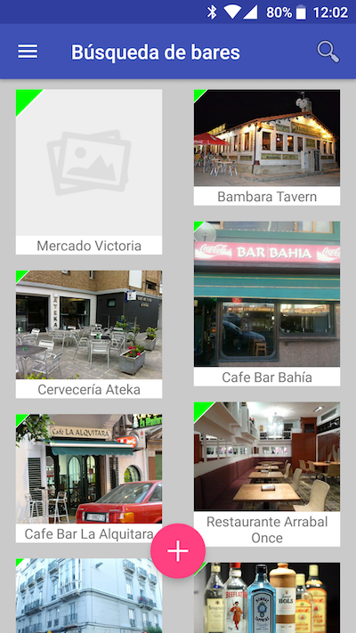

#PickAndGol

## Qué es PickAndGol

[PickAndGol](http://pickandgol.com) permite conocer los bares cercanos al usuario y qué eventos deportivos se pueden ver en cada bar, y dado un evento deportivo ver en qué bares se puede ver dicho evento. Asímismo se pueden realizar búsquedas tanto de bares como de eventos. Los usuarios registrados pueden dar de alta bares y eventos.

### Aplicación Android

En la pantalla inicial de la aplicación de Android aparece la lista de eventos. 

Cuando el usuario consulta el detalle de un evento puede visualizar en qué bares situados en un mapa se puede ver el evento.

La lista de eventos permite buscar eventos aplicando filtros de búsqueda. Estos filtros incluyen el texto del evento, la categoría (fútbol, fórmula 1, baloncesto, etc) y la distancia máxima del usuario donde buscar los bares donde ver el evento.

Seleccionando la búsqueda de bares en el menú lateral de la aplicación se puede ver la lista de bares. Cuando se consulta el detalle de un bar se puede acceder a la lista de futuros eventos del bar.

El usuario puede añadir bares a su lista de bares favoritos y cuando otro usuario añada un evento a uno de sus bares favoritos, recibirá una notificación en su móvil o Apple Watch informando que uno de sus bares favoritos tiene un nuevo evento al que poder asistir.

## Arquitectura de PickAndGol

### Backend

El backend de *PickAndGol* consta de las siguientes partes:

- [Nginx](https://nginx.org/) como servidor web. 
- Aplicación en [NodeJS](https://nodejs.org) y [ExpressJS](http://expressjs.com/) que responde a las peticiones HTTP y devuelve los resultados en formato [JSON](http://json.com/). Todas las aplicaciones (iOS, Android y web) hacen peticiones al backend para obtener y enviar datos.
- Servidor de base de datos [MongoDB](https://www.mongodb.com/).
- Servicio de almacenamient [S3 de Amazon](https://aws.amazon.com/es/s3/) para el almacenamiento.
- Todo corre sobre un servidor [EC2](https://aws.amazon.com/es/ec2/).

### Web

El frontend está desarrollado utilizando [AngularJS](https://angularjs.org/) en su versión 1.

### Android

- En la aplicación Android se ha utilizado [Realm](https://realm.io/) para mantener datos en el dispositivo.
- [Firebase](https://firebase.google.com/) para el sistema de notificaciones. Los usuarios reciben notificaciones que les informan que otro usuario ha dado de alta un evento en un bar que se encuentra en su lista de favoritos.
- API de Google Maps para situar los bares en el mapa.

### iOS y WatchOS

- [RxSwift](https://github.com/ReactiveX/RxSwift).
- [Firebase](https://firebase.google.com/) para las notificaciones.

